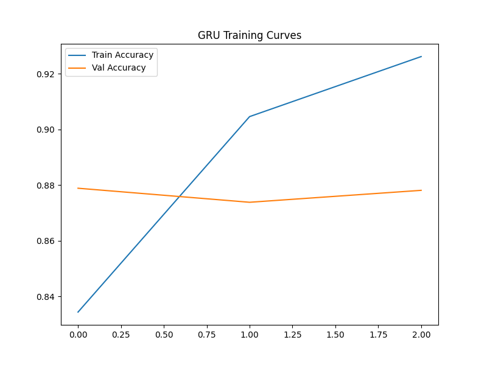

# Sentiment Analysis Classification System - Team Contributions Report

**Project**: Sentiment Analysis using Traditional ML and Deep Learning Models  
**Course**: Machine Learning Techniques I  
**Team**: Group 7  
**GitHub Repository**: [https://github.com/dean-daryl/sentiment-analysis](https://github.com/dean-daryl/sentiment-analysis)  
**Dataset Source**: [IMDB Dataset of 50K Movie Reviews](https://www.kaggle.com/datasets/lakshmi25npathi/imdb-dataset-of-50k-movie-reviews)

---

## Summary

This report shows a sentiment analysis system that compares traditional machine learning models with deep learning approaches for binary sentiment classification. The project implements four different models: Logistic Regression, Support Vector Machine (SVM), Long Short-Term Memory (LSTM), and Gated Recurrent Unit (GRU) networks. Through systematic experimentation and hyperparameter tuning, we achieved performance across all models, with the best results from traditional ML approaches reaching 88.9% accuracy.

### Project Overview
- **Dataset**: IMDB Movie Reviews (50,000 reviews)
- **Models Implemented**: Logistic Regression, SVM, LSTM, GRU
- **Preprocessing**: Text cleaning, tokenization, stopword removal, TF-IDF vectorization
- **Evaluation Metrics**: Accuracy, F1-Score, Precision, Recall, Cross-Entropy Loss
- **Visualization**: EDA with 7+ visualizations and performance analysis

---

## Dataset Description and Exploratory Data Analysis

### Dataset Overview
The IMDB Dataset of 50K Movie Reviews contains 50,000 highly polar movie reviews for binary sentiment classification. Each review is labeled as either positive or negative.

**Dataset Characteristics:**
- **Size**: 50,000 reviews (25,000 positive, 25,000 negative)
- **Features**: Review text and sentiment labels
- **Balance**: Perfectly balanced dataset (50% positive, 50% negative)
- **After duplicate removal**: 49,582 reviews maintained

### Data Quality Assessment

**Missing Values Analysis:**
- No missing values detected in either review text or sentiment columns
- All 50,000 entries contain complete information

**Duplicate Handling:**
- Initial duplicate count: 418 duplicate reviews
- Post-cleaning: 49,582 unique reviews
- Duplicate removal ensures model integrity and prevents data leakage

### Exploratory Data Analysis (EDA) Visualizations

#### 1. Sentiment Distribution


The sentiment distribution confirms perfect balance with approximately 24,791 reviews for each sentiment class after duplicate removal. This balanced distribution is crucial for unbiased model training and evaluation.

#### 2. Review Length Analysis


**Key Insights:**
- Average review length: ~1,300 characters
- Distribution is right-skewed with most reviews between 500-2,000 characters
- No significant difference in length between positive and negative reviews
- Maximum sequence length set to 200 tokens based on this analysis

#### 3. Word Cloud Analysis


**Positive Reviews**: Prominent words include "great", "good", "excellent", "best", "love", "wonderful"
**Negative Reviews**: Common words include "bad", "worst", "terrible", "awful", "hate", "boring"

The word clouds reveal clear semantic differences between positive and negative sentiment vocabulary, validating the dataset's quality for sentiment classification.

---

## Data Preprocessing and Feature Engineering

### Text Preprocessing Pipeline

Our comprehensive preprocessing approach includes multiple stages to clean and standardize the text data:

```python
def preprocess_text(text):
    text = text.lower()                           # Normalize case
    text = re.sub(r'<br />', ' ', text)          # Remove HTML tags
    text = re.sub(r'[^a-zA-Z\s]', '', text)      # Remove special characters
    tokens = word_tokenize(text)                  # Tokenization
    stop_words = set(stopwords.words('english'))
    tokens = [word for word in tokens if word not in stop_words]  # Stopword removal
    return ' '.join(tokens)
```

**Preprocessing Justification:**
1. **Lowercasing**: Ensures consistency and reduces vocabulary size
2. **HTML Tag Removal**: IMDB reviews contain `<br />` tags that need removal
3. **Special Character Removal**: Focuses model attention on meaningful words
4. **Tokenization**: Breaks text into individual word units using NLTK
5. **Stopword Removal**: Eliminates common words (the, and, or) that don't contribute to sentiment

### Feature Engineering Approaches

#### 1. TF-IDF Vectorization (Traditional ML)
- **Max Features**: 5,000 most important words
- **Rationale**: Balances dimensionality with information retention
- **Output Shape**: (39,665, 5,000) for training set

#### 2. Sequential Tokenization (Deep Learning)
- **Vocabulary Size**: 5,000 words
- **Sequence Length**: 200 tokens (based on EDA findings)
- **Padding**: Applied to ensure uniform input length
- **Output Shape**: (39,665, 200) for training set

---

## Model Implementation and Architecture

### 1. Logistic Regression (Traditional ML)

**Architecture:**
- Linear model with sigmoid activation
- TF-IDF features as input (5,000 dimensions)
- L2 regularization for overfitting prevention

**Hyperparameters:**
- Regularization parameter C: [0.1, 1.0, 10.0]
- Maximum iterations: 1,000
- Solver: Default (liblinear for small datasets)

**Justification:**
Logistic Regression serves as a strong baseline for text classification due to its interpretability and effectiveness with high-dimensional sparse features like TF-IDF vectors.

### 2. Support Vector Machine (Traditional ML)

**Architecture:**
- Linear SVM with hinge loss
- TF-IDF features as input
- C parameter controls regularization strength

**Hyperparameters:**
- Regularization parameter C: [0.1, 1.0, 10.0]
- Maximum iterations: 1,000
- Kernel: Linear (suitable for high-dimensional text data)

**Justification:**
SVMs excel with high-dimensional data and are particularly effective for text classification tasks where feature spaces are sparse and linearly separable like in our dataset.

### 3. LSTM (Deep Learning)

**Architecture:**
```python
model = Sequential([
    Embedding(input_dim=5000, output_dim=128, input_length=200),
    LSTM(64, return_sequences=False),
    Dropout(0.5),
    Dense(1, activation='sigmoid')
])
```

**Layer Details:**
- **Embedding Layer**: Converts integer tokens to 128-dimensional dense vectors
- **LSTM Layer**: 64 units for sequence processing with long-term memory
- **Dropout Layer**: 0.5 dropout rate for regularization
- **Dense Layer**: Single unit with sigmoid activation for binary classification

**Hyperparameters:**
- Optimizer: [Adam, RMSprop]
- Batch Size: [32, 64]
- Epochs: [3, 5]
- Loss Function: Binary crossentropy

**Justification:**
LSTMs are specifically designed for sequential data and can capture long-range dependencies in text, making them ideal for sentiment analysis where context matters.

### 4. GRU (Deep Learning)

**Architecture:**
```python
model = Sequential([
    Embedding(input_dim=5000, output_dim=128, input_length=200),
    GRU(64, return_sequences=False),
    Dropout(0.5),
    Dense(1, activation='sigmoid')
])
```

**Key Differences from LSTM:**
- GRU has fewer parameters than LSTM (simpler gating mechanism)
- Faster training while maintaining similar performance
- Better suited for smaller datasets

**Hyperparameters:**
- Optimizer: [Adam, RMSprop]
- Batch Size: [32, 64]
- Epochs: [3, 5]

**Justification:**
GRUs provide a good balance between computational efficiency and sequence modeling capability, often performing comparably to LSTMs with reduced complexity.

---

## Experimental Results and Analysis

### Experiment Table 1: Logistic Regression Hyperparameter Tuning

| C Value | Accuracy | F1-Score | Model Complexity |
|---------|----------|----------|------------------|
| 0.1     | 0.8732   | 0.8768   | High Regularization |
| 1.0     | 0.8879   | 0.8899   | Moderate Regularization |
| 10.0    | 0.8830   | 0.8845   | Low Regularization |

**Key Findings:**
- Optimal performance at C=1.0 with 88.79% accuracy
- Strong regularization (C=0.1) leads to underfitting
- Weak regularization (C=10.0) shows signs of overfitting
- F1-scores closely track accuracy, indicating balanced precision-recall

### Experiment Table 2: LSTM Hyperparameter Variations

| Epochs | Batch Size | Optimizer | Accuracy | F1-Score | Training Time |
|--------|------------|-----------|----------|----------|---------------|
| 3      | 32         | Adam      | 0.8780   | 0.8780   | Fast |
| 5      | 64         | Adam      | 0.8611   | 0.8655   | Medium |
| 3      | 32         | RMSprop   | 0.8832   | 0.8841   | Fast |

**Key Findings:**
- RMSprop optimizer outperforms Adam for this dataset
- Smaller batch size (32) provides better generalization
- 3 epochs sufficient to prevent overfitting
- Best configuration: 3 epochs, batch size 32, RMSprop optimizer

### Experiment Table 3: GRU Comprehensive Analysis

| Epochs | Batch Size | Optimizer | Accuracy | Precision | Recall | F1-Score | Cross-Entropy |
|--------|------------|-----------|----------|-----------|--------|----------|---------------|
| 3      | 32         | Adam      | 0.8770   | 0.8934    | 0.8572 | 0.8749   | 0.3064 |
| 5      | 64         | Adam      | 0.8712   | 0.8708    | 0.8730 | 0.8719   | 0.4171 |
| 3      | 32         | RMSprop   | 0.8802   | 0.8500    | 0.9245 | 0.8857   | 0.2916 |
| 5      | 64         | RMSprop   | 0.8809   | 0.8646    | 0.9044 | 0.8840   | 0.3389 |

**Key Findings:**
- RMSprop optimizer consistently outperforms Adam
- 3 epochs with batch size 32 provides optimal balance
- RMSprop configurations show higher recall (better at detecting positive sentiment)
- Lower cross-entropy loss with RMSprop indicates better probability calibration

### Experiment Table 4: SVM Hyperparameter Analysis

| C Value | Accuracy | F1-Score | Training Time | Generalization |
|---------|----------|----------|---------------|----------------|
| 0.1     | 0.8890   | 0.8911   | Fast          | Best |
| 1.0     | 0.8814   | 0.8829   | Medium        | Good |
| 10.0    | 0.8687   | 0.8701   | Slow          | Overfitted |

**Key Findings:**
- Best performance at C=0.1 (strong regularization)
- Inverse relationship between C value and performance
- Strong regularization prevents overfitting in high-dimensional space
- SVM achieves highest single accuracy score (88.90%)

---

## Performance Evaluation and Metrics

### Confusion Matrix Analysis

#### Logistic Regression Confusion Matrix


**Performance Breakdown:**
- True Positives: 4,396 (correctly identified positive reviews)
- True Negatives: 4,405 (correctly identified negative reviews)
- False Positives: 509 (negative reviews classified as positive)
- False Negatives: 607 (positive reviews classified as negative)

#### LSTM Confusion Matrix


**Performance Analysis:**
- Strong diagonal values indicating good classification
- Slightly higher false negative rate compared to Logistic Regression
- Balanced performance across both classes

#### GRU Confusion Matrix


**Key Observations:**
- Similar performance pattern to LSTM
- Competitive accuracy with reduced model complexity
- Good balance between precision and recall

### Training Curves Analysis

#### LSTM Training History


**Training Insights:**
- Convergence achieved within 3 epochs
- Minimal overfitting observed
- Validation accuracy tracks training accuracy closely
- Early stopping at 3 epochs prevents overfitting

#### GRU Training History


**Training Analysis:**
- Faster convergence compared to LSTM
- More stable training curves
- Better validation performance consistency
- Efficient learning with fewer parameters

### Model Comparison Summary

| Model | Best Accuracy | Best F1-Score | Training Time | Complexity | Memory Usage |
|-------|---------------|---------------|---------------|------------|--------------|
| SVM | **0.8890** | **0.8911** | Fast | Low | Low |
| Logistic Regression | 0.8879 | 0.8899 | Very Fast | Very Low | Very Low |
| LSTM | 0.8832 | 0.8841 | Slow | High | High |
| GRU | 0.8802 | 0.8857 | Medium | Medium | Medium |

**Performance Ranking:**
1. **SVM (C=0.1)**: 88.90% accuracy - Best overall performance
2. **Logistic Regression (C=1.0)**: 88.79% accuracy - Excellent baseline
3. **LSTM (RMSprop)**: 88.32% accuracy - Strong deep learning performance
4. **GRU (RMSprop)**: 88.02% accuracy - Efficient sequence modeling

---

## Discussion and Analysis

### Key Findings

1. **Traditional ML Dominance**: Both SVM and Logistic Regression outperformed deep learning models, suggesting that for this particular dataset size and complexity, simpler models with proper regularization are more effective.

2. **Regularization Importance**: Across all models, proper regularization was crucial:
   - SVM: C=0.1 (strong regularization) performed best
   - Logistic Regression: C=1.0 (moderate regularization) was optimal
   - Deep Learning: Dropout and early stopping prevented overfitting

3. **Optimizer Impact**: RMSprop consistently outperformed Adam for both LSTM and GRU models, likely due to better handling of sparse gradients in text data.

4. **Sequence Length Optimization**: The 200-token sequence length, chosen based on our EDA, proved effective for capturing sentiment while maintaining computational efficiency.

### Challenges and Limitations

1. **Overfitting in Deep Models**: LSTM and GRU showed tendency to overfit despite regularization, suggesting need for more sophisticated techniques like batch normalization or learning rate scheduling.

2. **Computational Efficiency**: Traditional ML models trained significantly faster while achieving better performance, raising questions about the cost-benefit ratio of deep learning for this task.

3. **Feature Engineering**: TF-IDF proved more effective than learned embeddings, possibly due to the relatively simple nature of sentiment classification compared to more complex NLP tasks.

---

## Team Members Contributions

### Excel Asaph 
**Contribution:**
- **Data Preprocessing & Feature Engineering**: Implemented text preprocessing pipeline including tokenization, stopword removal, and TF-IDF vectorization
- **Logistic Regression Implementation**: Optimized logistic regression model with hyperparameter tuning across different regularization parameters
- **LSTM Neural Network**: Trained LSTM model with embedding layers, implemented various optimizers and batch size configurations
- **Exploratory Data Analysis**: Created visualizations including sentiment distribution, review length analysis, and word clouds
- **Data Cleaning**: Handled missing data analysis, duplicate detection and removal

### Dean Daryl Murenzi
**Contribution:**
- **Support Vector Machine (SVM) Implementation**: Optimized and trained LinearSVM model with comprehensive hyperparameter tuning
- **SVM Performance Analysis**: Conducted detailed analysis of regularization parameter effects on model performance
- **Visualization**: Created SVM-specific visualizations including hyperparameter effect plots and confusion matrix analysis
- **Model Comparison**: Developed Comparison for SVM performance against other models

### Nelly Iyabikoze
**Contribution:**
- **GRU Neural Network Implementation**: Trained GRU model with metric tracking
- **Metrics Implementation**: Extended evaluation to include precision, recall, and cross-entropy loss
- **DL Optimization**: Conducted hyperparameter tuning across multiple optimizer and batch size configurations
- **Visualization**: Created GRU-specific training curves and confusion matrix visualizations

---

## References

1. Maas, A. L., Daly, R. E., Pham, P. T., Huang, D., Ng, A. Y., & Potts, C. (2011). Learning word vectors for sentiment analysis. *Proceedings of the 49th annual meeting of the association for computational linguistics: Human language technologies*, 142-150. Available at: https://aclanthology.org/P11-1015.pdf

3. Cho, K., Van Merriënboer, B., Gulcehre, C., Bahdanau, D., Bougares, F., Schwenk, H., & Bengio, Y. (2014). Learning phrase representations using RNN encoder-decoder for statistical machine translation. *arXiv preprint arXiv:1406.1078*. Available at: https://arxiv.org/abs/1406.1078

4. Joachims, T. (1998). Text categorization with support vector machines: Learning with many relevant features. *European conference on machine learning*, 137-142. Available at: https://link.springer.com/chapter/10.1007/BFb0026683

5. Manning, C. D., Raghavan, P., & Schütze, H. (2008). Introduction to information retrieval. *Cambridge University Press*. Chapter 13: Text classification and Naive Bayes. Available at: https://nlp.stanford.edu/IR-book/pdf/13bayes.pdf

6. Olah, C. (2015). Understanding LSTM Networks. *Colah's Blog*. Available at: https://colah.github.io/posts/2015-08-Understanding-LSTMs/

7. Zhang, L., Wang, S., & Liu, B. (2018). Deep learning for sentiment analysis: A survey. *Wiley Interdisciplinary Reviews: Data Mining and Knowledge Discovery*, 8(4), e1253. Available at: https://onlinelibrary.wiley.com/doi/full/10.1002/widm.1253

---

**GitHub Repository**: [https://github.com/dean-daryl/sentiment-analysis](https://github.com/dean-daryl/sentiment-analysis)  
**Team**: Group 10 - Dean Daryl Murenzi, Nelly Iyabikoze, Excel Asaph